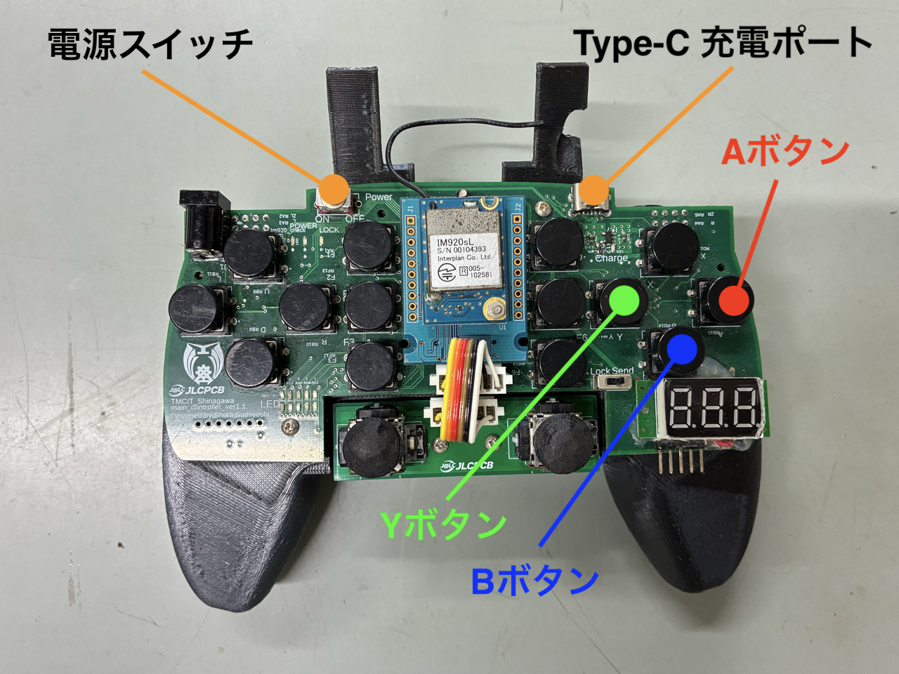
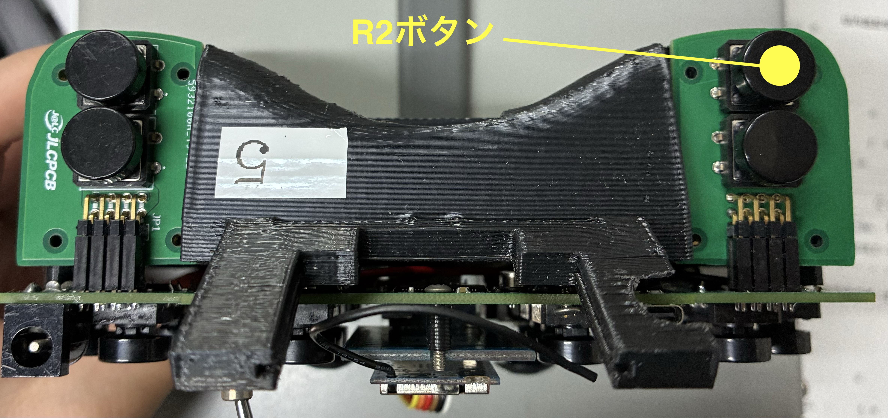
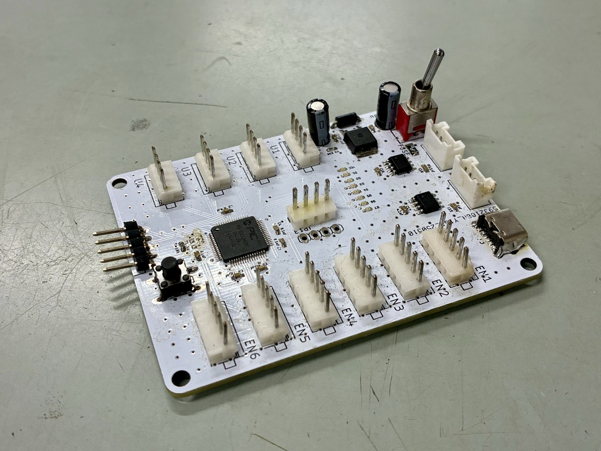
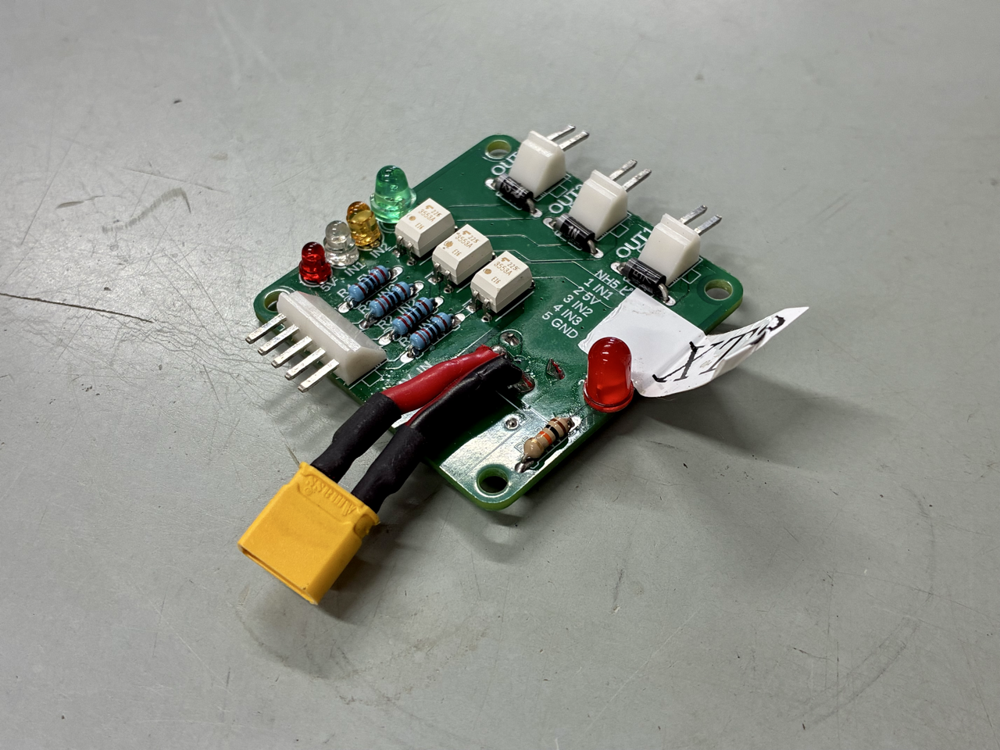
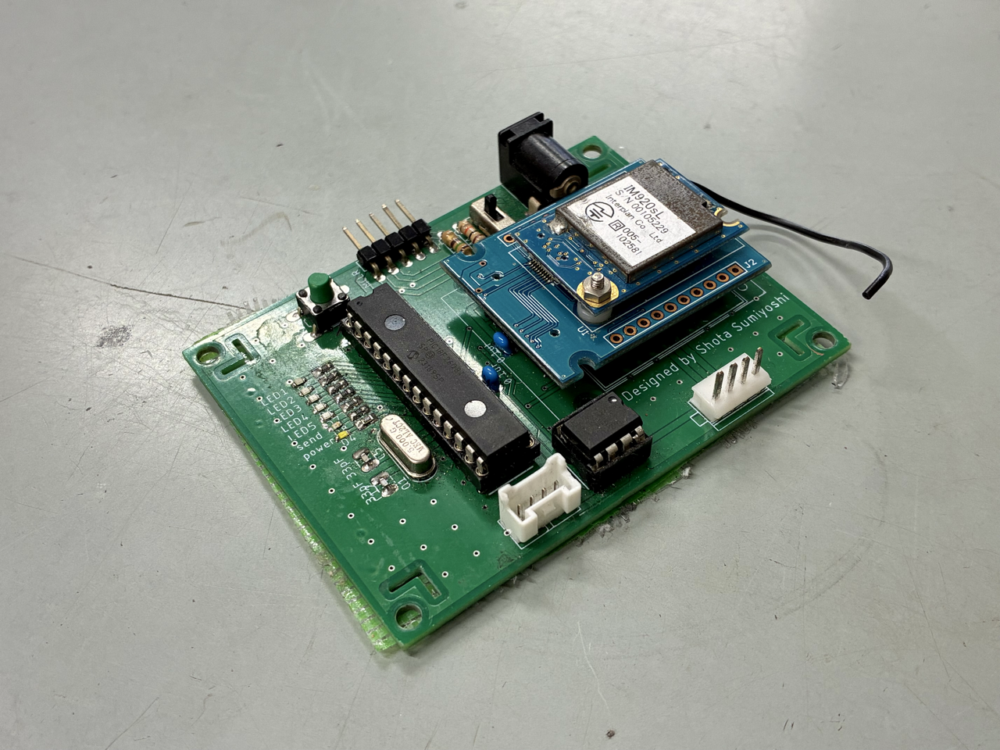
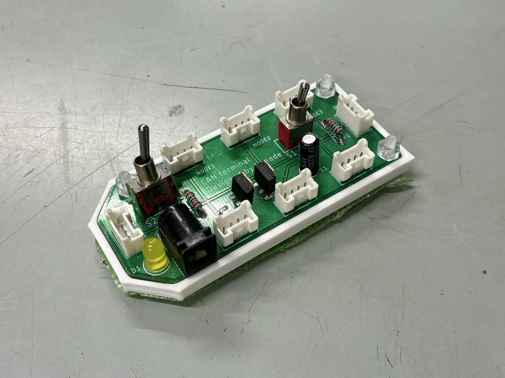
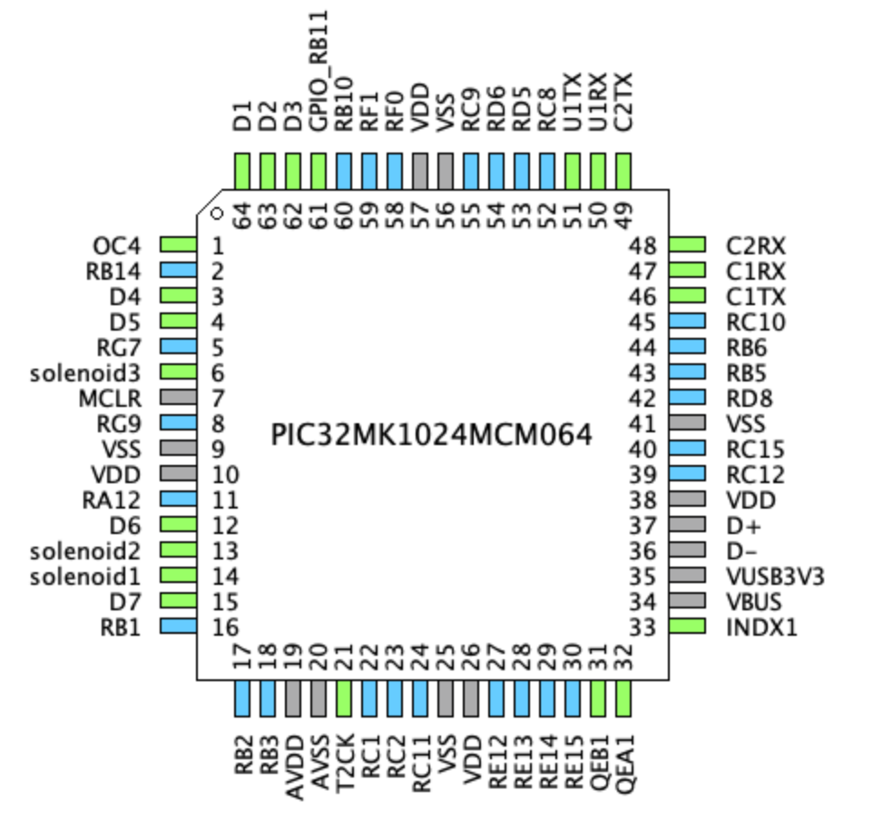

<!-- # 2026B ファームウェア ~ エアー式スロー機構 ~

Author: kuroi217
 
Last Updated: July 16, 2026

（ここに機構のいい感じな画像）

## 操作方法

### - Bボタン・R2ボタン 同時押し: 射出
### - Aボタン・R2ボタン 同時押し： 復帰
### - Yボタン・R2ボタン 同時押し： 保持機構の開閉

## 基板構成
### - 2025A メイン基板（試作） ×1

### - 2026 電磁弁Unit基板 ×1

### - コントローラー受信基板(ファームウェア最新版) ×1

### - CANターミナル基板 ×1

## ペリフェラル

### - CAN1
- C1TX: 46, RB7
- C1RX: 47, RC13

### - LED
- D1: 64, RA10
- D2: 63, RB13
- D3: 62, RB12
- D4: 3, RB15
- D5: 4, RG6
- D6: 12, RA11
- D7: 15, RB0

### - 電磁弁
- solenoid1: 14, RA1 
  射出機構の射出(solenoid1: ON, solenoid3: OFF)
- solenoid2: 13, RA0 
  射出機構の復帰(トグル)
- solenoid3: 6, RG8 
  保持機構の開閉(solenoid1: OFF, solenoid3: ON) -->